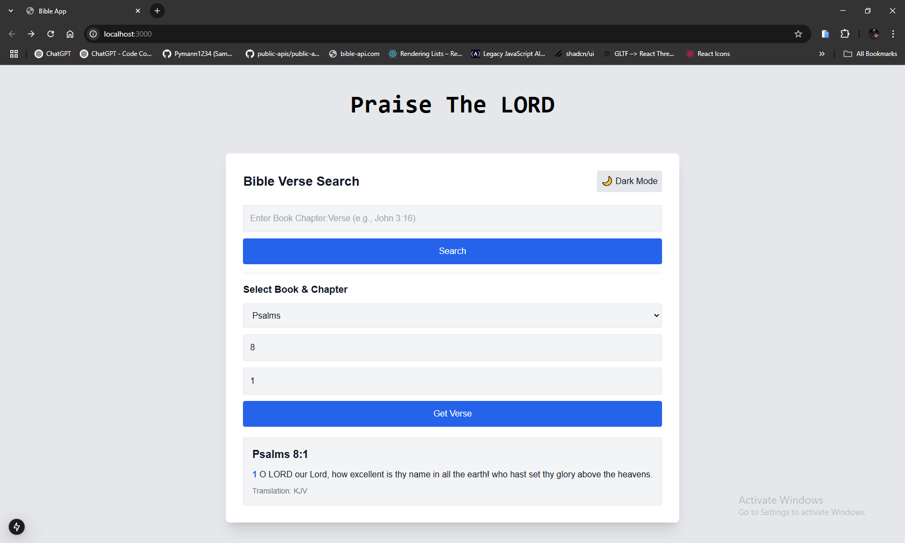
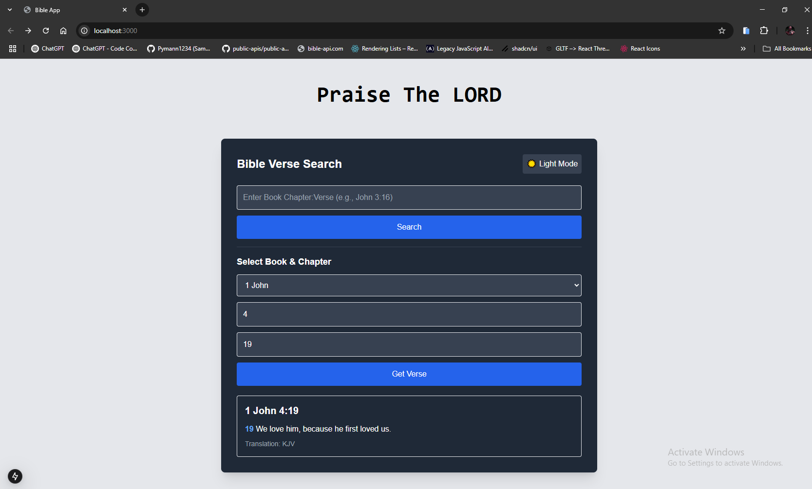

# The Holy Bible

Bible Verse Search is a web application that allows users to search for Bible verses using either a manual text search or a dropdown-based selection. The app fetches data from the Bible API and supports dark mode for a better user experience.

## 🚀 Live Demo - https://bible-alpha.vercel.app/

## 🚀 Features

- 🔍 **Search by Book, Chapter, and Verse**: Enter queries like `John 3:16` to fetch specific verses.
- 📖 **Dropdown Selection**: Select a book and chapter from the dropdown for easy navigation.
- 🌙 **Dark Mode Toggle**: Switch between light and dark mode, with preferences saved in `localStorage`.
- 📱 **Fully Responsive**: Works seamlessly on mobile, tablet, and desktop.
- 🎨 **Modern UI**: Styled with TailwindCSS for a sleek and user-friendly interface.

## 🛠️ Technologies Used

- **Next.js** - React framework for building fast web applications.
- **TailwindCSS** - Utility-first CSS framework for modern styling.
- **Bible API** - Free API to fetch KJV Bible verses.
- **LocalStorage** - Used for persisting dark mode preference.

## 📸 Screenshots

### 🔹 Light Mode


### 🔹 Dark Mode


## 🚀 Installation & Setup

1. **Clone the repository:**

   ```sh
   git clone https://github.com/yourusername/theHolyBible.git
   cd theHolyBible
   ```

2. **Install dependencies:**

   ```sh
   npm install
   # or
   yarn install
   ```

3. **Run the development server:**

   ```sh
   npm run dev
   ```

4. **Open the app:**
   Navigate to [http://localhost:3000](http://localhost:3000) in your browser.

## 🔗 API Usage

This app uses the [Bible API](https://bible-api.com/) to fetch verse data.

Example API request:

```
GET https://bible-api.com/John%203:16?translation=kjv
```

## 📂 Project Structure

```
📁 bible
│── 📂 .next            # compiled the application
│── 📂 app              # Source code
│   ├── 📂 components   # UI components
│   ├── 📜 globals.css  # css - tailwindcss
│   ├── 📜 layout.jsx   # Main app logic (metadata)
│   ├── 📜 page.jsx     # Main page display on the webpage
│── 📜 package.json     # Dependencies & scripts
│── 📜 README.md        # Project documentation
```

## 💡 Future Enhancements

- 📜 **Multiple Translations** - Add support for other Bible translations, (currently using KJV).
- 🔖 **Bookmark Feature** - Allow users to save favorite verses.
- 📢 **Share Verses** - Add a feature to share verses on social media.

## 🤝 Contributing

Contributions are welcome! Feel free to fork the repo and submit a PR.

## 🛡️ License

This project is licensed under the MIT License.

---

✨ **Created with ❤️ and faith!**
